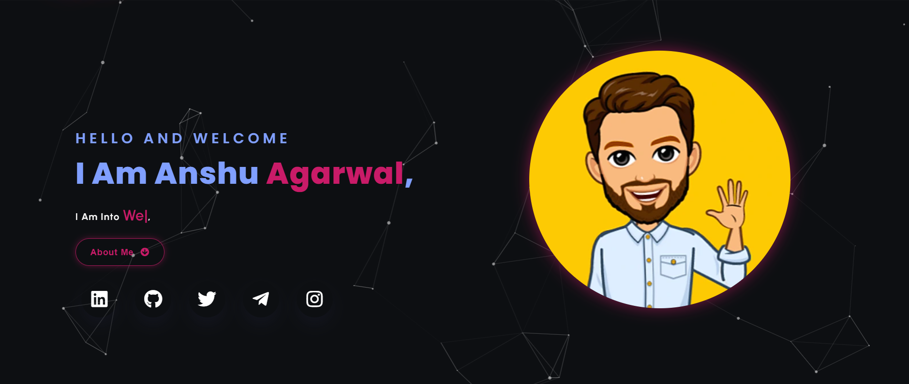
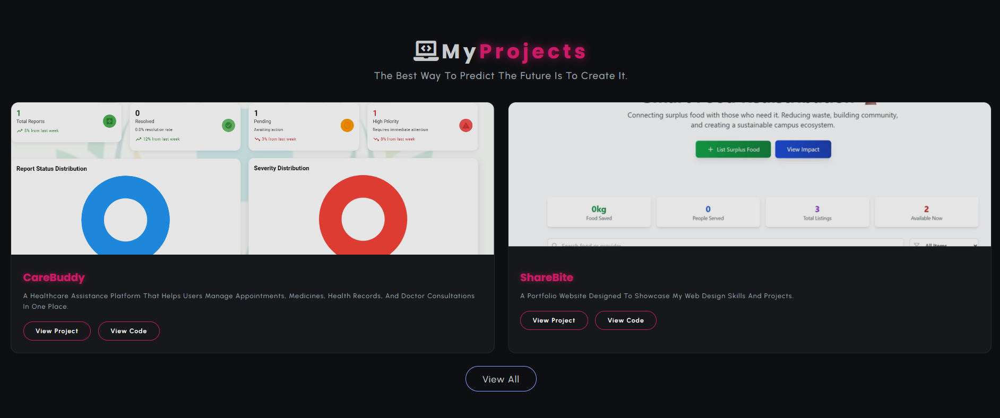

# 💼 Personal Portfolio Website

A responsive and modern personal portfolio website to showcase my skills, projects, and experience as a full stack developer.

## 🔗 Live Demo

<p>
  <a href="https://your-netlify-link.netlify.app/" target="_blank" style="padding: 8px 16px; background-color: #28a745; color: white; border-radius: 6px; text-decoration: none; font-weight: bold;">
    🌐 View Netlify Portfolio
  </a>
</p>

<p>
  <a href="https://anshuaga.github.io/Portfolio/" target="_blank" style="padding: 8px 16px; background-color: #0366d6; color: white; border-radius: 6px; text-decoration: none; font-weight: bold;">
    🔗 View GitHub Pages Portfolio
  </a>
</p>

---

## 🛠️ Built With

 
 
 
 
 


---

### Extras :

Particle.js, Typed.js, Tilt.js, Scroll Reveal, Font Awesome and JSON

---

## 📁 Features

* 🌐 Fully responsive design for all devices
* 🧑‍💻 Projects section with GitHub/live links
* 📄 Downloadable resume
* 📬 Contact form
* 🎨 Smooth animations and transitions
* ⚡ Interactive particle background
* 📱 Mobile-friendly layout

---

## 🖼️ Screenshots

Add your own screenshots here after uploading images of your portfolio.

```md


```

---

## 📬 Contact

Feel free to reach me through the below handles if you'd like to contact me.

[](https://www.linkedin.com/in/your-linkedin/)

[](https://github.com/AnshuAga)

[](https://www.instagram.com/yourinstagram/)

---

## 🚀 Getting Started

### Clone the repository:

```bash
git clone https://github.com/AnshuAga/Portfolio.git
```

### Open the project folder:

```bash
cd Portfolio
```

### Run the project:

Open `index.html` in your browser or use Live Server in VS Code.
